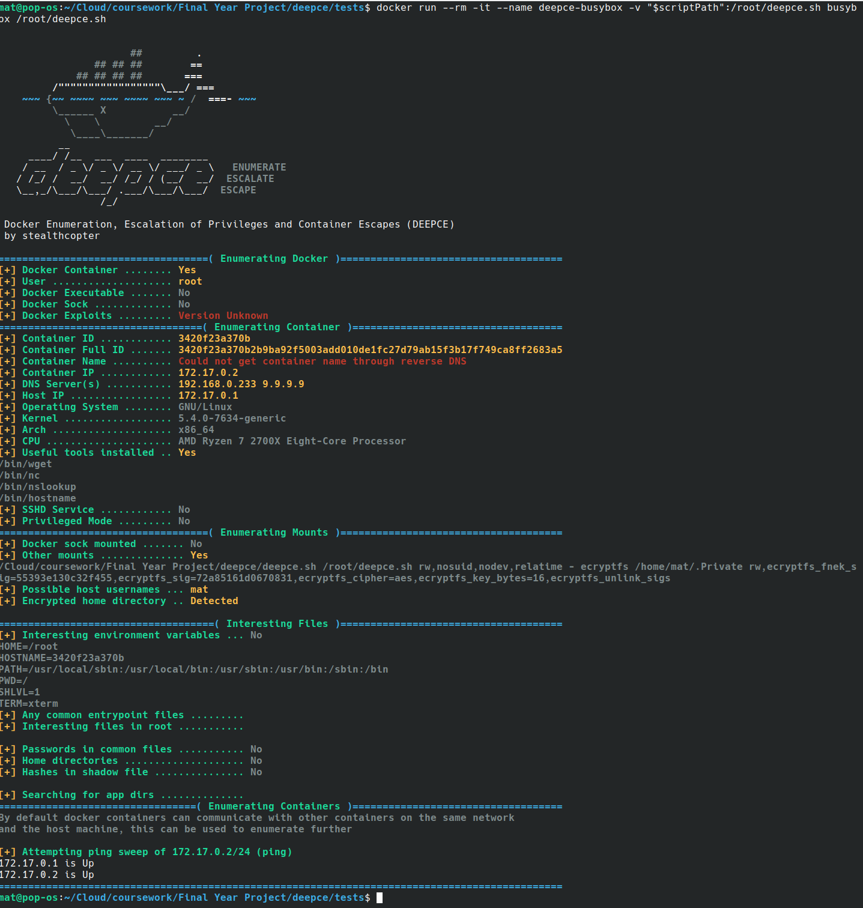

# deepce

```
                      ##         .
                ## ## ##        ==
             ## ## ## ##       ===
         /"""""""""""""""""\___/ ===
    ~~~ {~~ ~~~~ ~~~ ~~~~ ~~~ ~ /  ===- ~~~
         \______ X           __/
           \    \         __/
            \____\_______/
          __                        
     ____/ /__  ___  ____  ________ 
    / __  / _ \/ _ \/ __ \/ ___/ _ \   ENUMERATE
   / /_/ /  __/  __/ /_/ / (__/  __/  ESCALATE
   \__,_/\___/\___/ .___/\___/\___/  ESCAPE
                 /_/
```

Docker Enumeration, Escalation of Privileges and Container Escapes (DEEPCE)

In order for it to be compatible with the maximum number of containers DEEPCE is written in pure `sh` with no dependancies. It will make use of additional tools such as curl, nmap, nslookup and dig if avaliable but for the most part is not reliant upon them for enumeration.

None of the enumeration should touch the disk, however most of the exploits create new containers which will cause disk writes and some of the exploits overwrite runC which can be destructive, so be careful!

Please see below for a list of the enumerations, exploits and payloads DEEPCE can use. If you have ideas for any more please submit an issue in github!

# Downloading

DEEPCE can be downloaded onto a host or container using one of the following one-liners. Tip: download to `/dev/shm` to avoid touching the disk when downloading.

```bash
wget https://github.com/stealthcopter/deepce/raw/master/deepce.sh
curl -s https://github.com/stealthcopter/deepce/raw/master/deepce.sh -o deepce.sh
# Or using python requests
python -c 'import requests;print(requests.get("https://github.com/stealthcopter/deepce/raw/master/deepce.sh").content)' > deepce.sh 
python3 -c 'import requests;print(requests.get("https://github.com/stealthcopter/deepce/raw/master/deepce.sh").content.decode("utf-8"))' > deepce.sh  
```

# Screenshots




## Enumerations

The following is the list of enumerations performed by DEEPCE. 

- Container ID & name (via reverse dns)
- Container IP / DNS Server
- Docker Version
- Interesting mounts
- Passwords in common files
- Environment variables
- Password hashes
- Common sensitive files stored in containers
- Other containers on same network
- Port scan other container and the host machine
- Find exposed docker sock

## Exploits

- Docker Group Privledge Escaltion
- Priveledged mode host command execution
- Exposed Docker Sock

## Payloads

For each of the exploits above payloads can be defined in order to exploit the host system. These include:

- Reverse TCP shell
- Print /etc/shadow
- Add new root user
- Run custom commands
- Run custom payload binaries

# Examples
```bash
./deepce.sh 
```

# Advanced Usage

It is possible to download and run deepce without touching the disk, however you will be unable easily set arguments (direct maniuplation of variables is possible using export).

```bash
wget -O - https://github.com/stealthcopter/deepce/raw/master/deepce.sh | sh
curl -s https://github.com/stealthcopter/deepce/raw/master/deepce.sh | sh
```

# Inspiration

There are some great container enumeration/escape scripts and enumeration tools that I've got inspiration from when writing this. Howevr I felt the need to write one purely in `sh` in order to avoid having to install go / ruby dependancies or be reliant on a static binary. I also wanted to be able to perform more enumerations to try to discover what the docker container is as during as test we may end up inside an unknown container. The number of things this script can enumerate got away from me as every time I added something new I thought of more additional things I could add.

- LinEnum.sh
- LinPEAS
- BotB - Break out the box
- Harpoon

# Resources

Developer looking for Docker security tips
https://github.com/OWASP/CheatSheetSeries/blob/master/cheatsheets/Docker_Security_Cheat_Sheet.md


# Contributing

I welcome pull requests, issues and feedback.

- Fork it
- Create your feature branch (git checkout -b my-new-feature)
- Commit your changes (git commit -am 'Added some feature')
- Push to the branch (git push origin my-new-feature)
- Create new Pull Request


