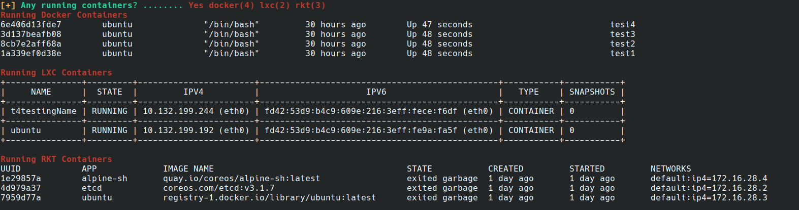

# About deepce

Deepce was developed by [stealthcopter](https://github.com/stealthcopter/) as part of a master thesis in computer securtiy systems.

Source code is in [GitHub](https://github.com/stealthcopter/deepce/).

# Contributions

As part of this project I wanted to give back to the open source software that I use, here is a list of the contributions I've made based upon the knowledge learned here.

## Metasploit

### Module: post/linux/gather/enum_containers
https://github.com/rapid7/metasploit-framework/pull/13844

### Module: exploit/linux/local/lxc_privilege_escalation
https://github.com/rapid7/metasploit-framework/pull/13869

### Module: exploit/linux/local/docker_privileged_container_escape

## linPEAS

https://github.com/carlospolop/privilege-escalation-awesome-scripts-suite/pull/53 

