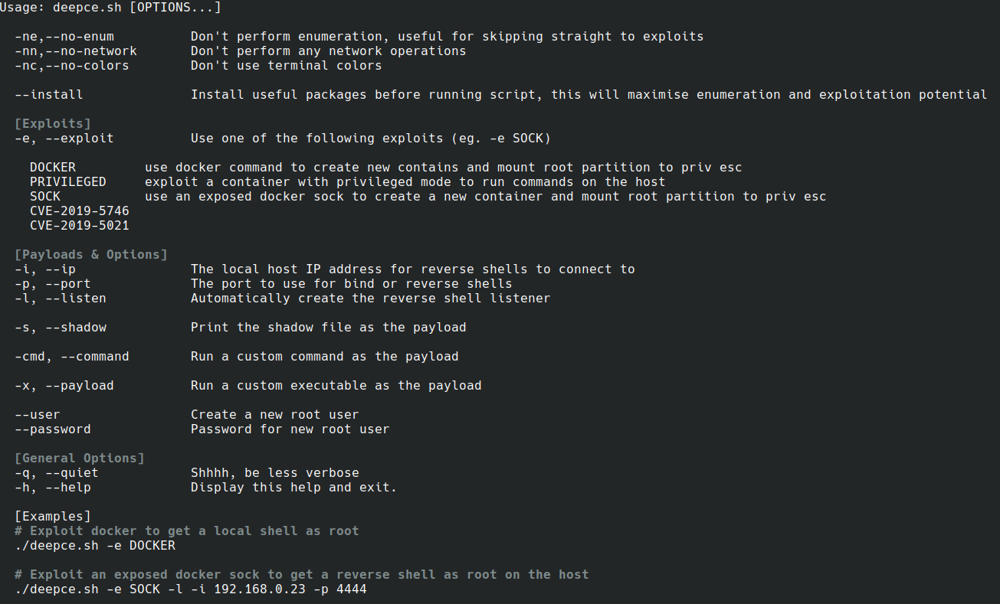
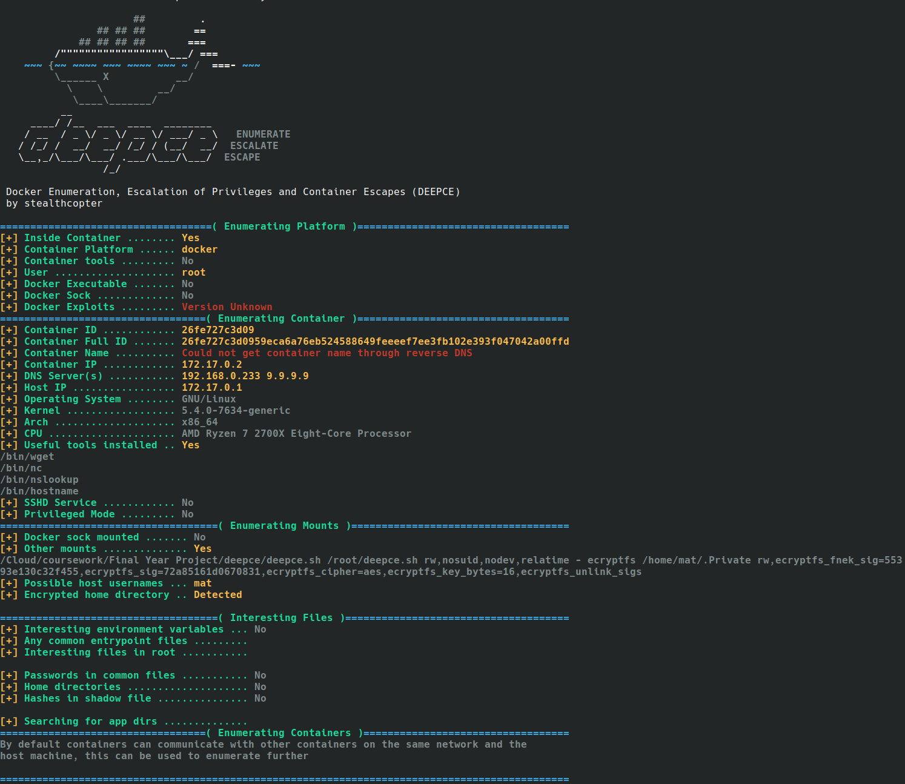
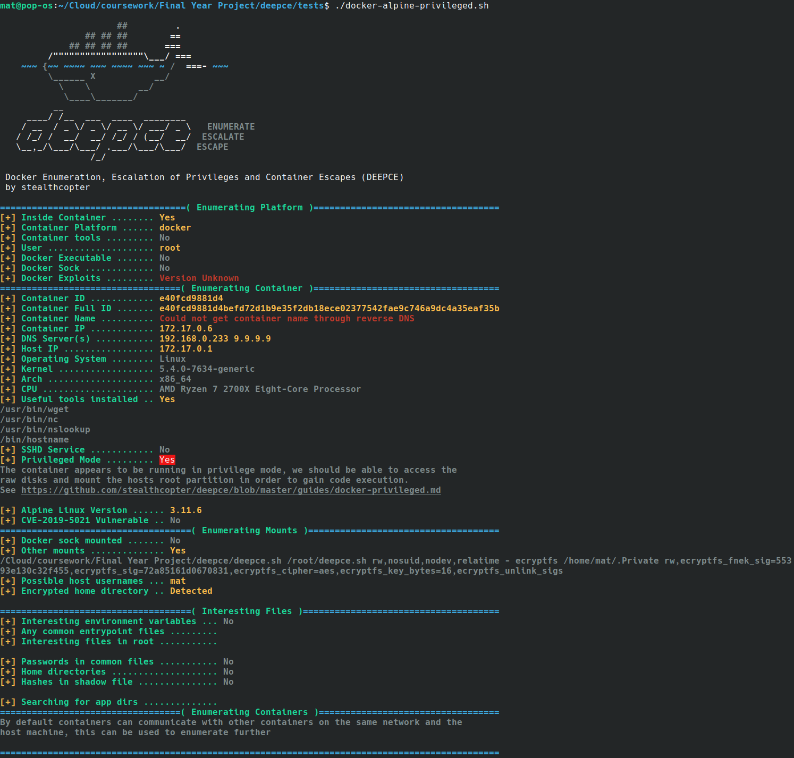
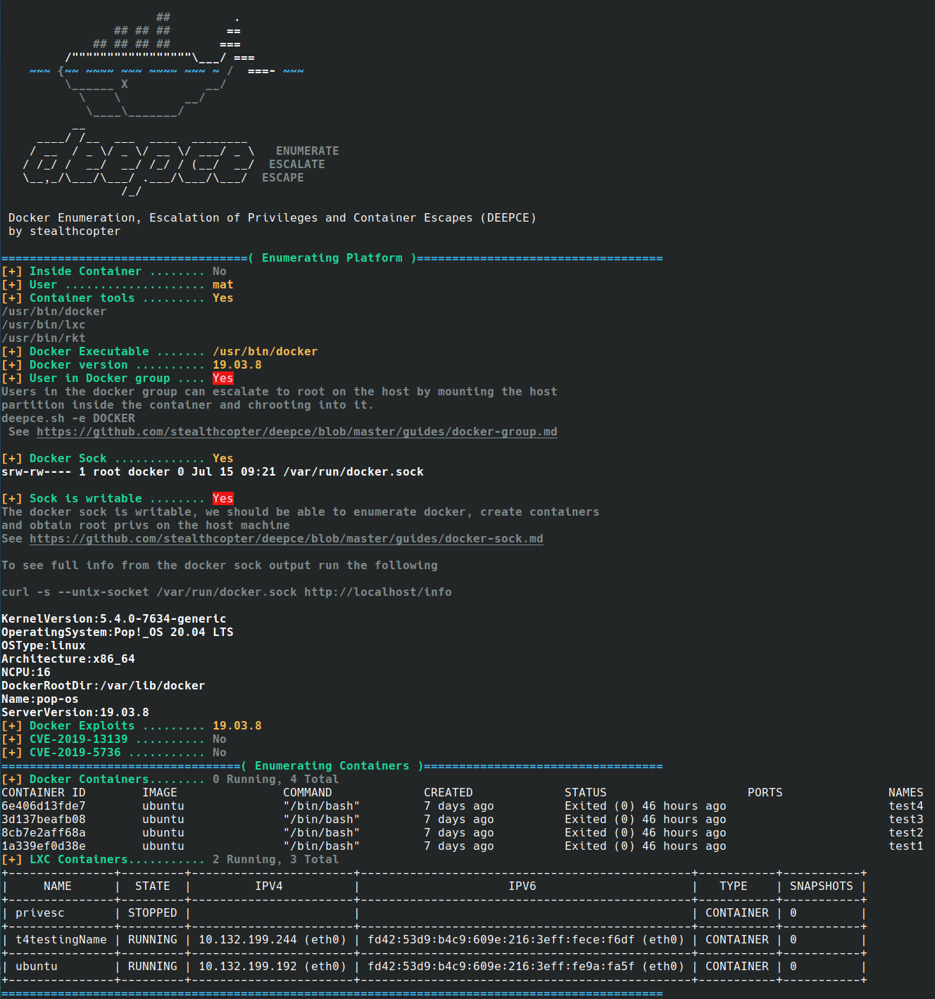

# Screenshots

## Help
Help text

## Inside a container
A Docker Ubuntu container with the network scanning and automatically install packages (`--install`) options turned on 

A Docker Busybox container

A privileged Docker Alpine container

## On a Host
An example showing the script running on a host rather than inside of a container
